<div align="center">



**Computer Science student at SCU** — I build tools that catch problems before they become incidents: CLIs, backends, and mobile apps, across Go, Java, and Kotlin.

<a href="https://github.com/zeexz?tab=followers"></a>
<a href="https://github.com/zeexz/leakscan/stargazers"></a>


<br>


</div>

<br>

## 🔭 Featured Project

<table>
<tr>
<td width="100%">

### 🔐 leakscan — Local-First Secret & Credential Scanner

A fast CLI + interactive TUI, written in Go, that hunts down leaked secrets, API keys, and credentials across your filesystem, full Git history, shell logs, and live process environment.

- **Dual-engine detection** — regex + Shannon entropy
- **Zero network calls** — fully local-first
- **CI/CD-ready** — JSON output for gating pull requests on findings
- **Supply-chain hygiene** — GoReleaser cross-compiled binaries, `cosign` keyless signing, and CycloneDX SBOMs on every release

> Early-stage: the core pipeline is covered by unit + fuzz tests, but it hasn't had an external security review yet or been benchmarked for false-positive rates at scale.

**[View Project →](https://github.com/zeexz/leakscan)**

</td>
</tr>
</table>

<br>

## 🛠️ Other Projects

<table>
<tr>
<td width="50%" valign="top">

### 🗝️ Cipher-Share
A "burn-after-reading" secure file and text sharing app built with Java 21 and Spring Boot 3. Focuses on self-destructing records and secure data handling.

**[View Project →](https://github.com/zeexz/Cipher-Share)**

</td>
<td width="50%" valign="top">

### 💰 Smart-Wallet
An Android expense tracker that pulls in live currency exchange rates and financial news via API integrations.

**[View Project →](https://github.com/zeexz/Smart-Wallet)**

</td>
</tr>
</table>

<br>

## 📌 About Me

- 🎓 Studying **Computer Science** at **SCU**
- 🔐 Building security-first tooling — CLI scanners, cryptographic implementations, and safe-by-default systems
- ☕ Comfortable across **Go**, the **Java ecosystem** (Java 21, Spring Boot 3.x), and **Android/Kotlin**
- ⚙️ Digging into **low-level systems** — memory management, OS internals, and how things actually work under the hood
- 📖 Currently reinforcing **C/C++ fundamentals** alongside Spring Security and applied cryptography

<br>

## 🌍 Live Status

<!--STATUS_START-->
```text
📍 Location   : Colombo, Sri Lanka
🕒 Local Time : 14:40, Sunday 30 August 2026
🌤️ Weather    : 🌤️ Partly Cloudy, 29°C
```
<!--STATUS_END-->

<br>

## ⚡ Currently Building

<!--BUILDING_START-->
```text
📦 Repo     : leakscan
📝 About    : Local-first secret & credential scanner
💻 Language : Go
🕓 Updated  : 3h ago
```
**[View Repo →](https://github.com/zeexz/leakscan)**
<!--BUILDING_END-->

<sub>Live Status and Currently Building are auto-refreshed every 30 minutes via GitHub Actions.</sub>

<br>

## 📊 GitHub Analytics

<div align="center">


</div>

<br>

## 🤝 Let's Connect

<div align="center">

<a href="https://www.linkedin.com/in/gihan-hemachandra-2b3a8026a/" target="_blank"></a>
<a href="https://x.com/gihan_hema" target="_blank"></a>
<a href="mailto:prabhashwaragihan@gmail.com" target="_blank"></a>

</div>
